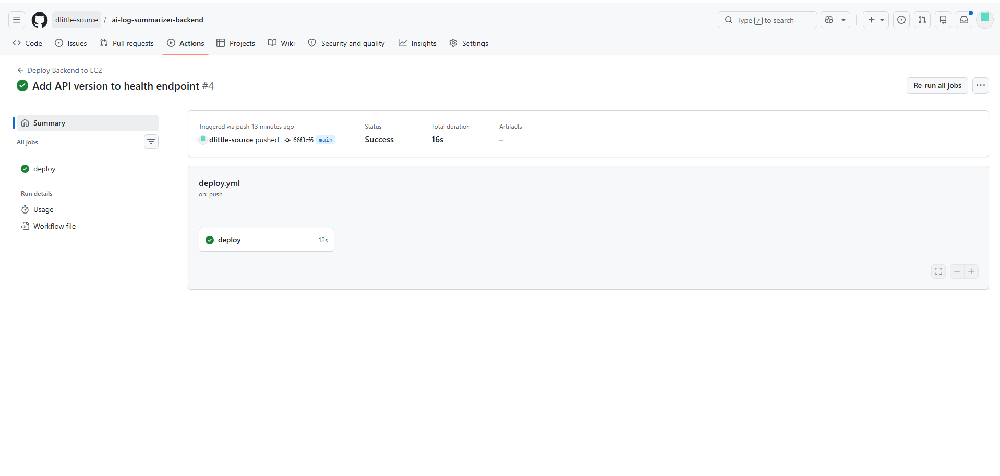
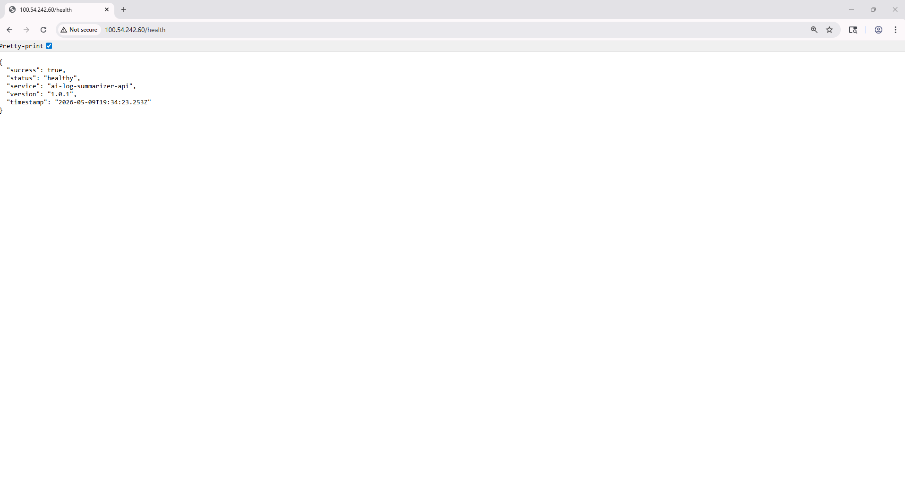

# AI Log Summarizer Backend

AI-powered backend API designed to analyze and summarize application, infrastructure, and system logs using OpenAI.

This project demonstrates a complete DevOps deployment workflow using Docker, Nginx, AWS EC2, and GitHub Actions CI/CD automation.

---

# Project Overview

The AI Log Summarizer Backend helps developers and DevOps engineers quickly process large log outputs and receive concise summaries through an API-driven workflow.

The backend was containerized with Docker, deployed to AWS EC2, proxied through Nginx, and automated with GitHub Actions CI/CD.

---

# Features

* AI-powered log summarization
* REST API backend
* Dockerized Node.js application
* AWS EC2 deployment
* Nginx reverse proxy
* GitHub Actions CI/CD automation
* Automated Docker deployments
* Health endpoint validation
* Environment variable protection using `.env`
* Production-style deployment workflow

---

# Infrastructure Architecture

```txt
Developer Push
   ↓
GitHub Repository
   ↓
GitHub Actions CI/CD
   ↓
AWS EC2 Ubuntu Server
   ↓
Docker Container
   ↓
Node.js Backend API
   ↓
Nginx Reverse Proxy
   ↓
Public Health Endpoint
```

---

# Tech Stack

* Backend Runtime

  * Node.js
  * Express.js

* Containerization

  * Docker

* Reverse Proxy

  * Nginx

* Cloud Platform

  * AWS EC2

* CI/CD

  * GitHub Actions

* Operating System

  * Ubuntu Linux

* AI Integration

  * OpenAI API

---

# API Health Endpoint

```txt
GET /health
```

Example response:

```json
{
  "success": true,
  "status": "healthy",
  "service": "ai-log-summarizer-api",
  "version": "1.0.1"
}
```

---

# Docker Deployment

## Build Docker Image

```bash
docker build -t project2-backend .
```

## Run Docker Container

```bash
docker run -d \
  --name project2-backend-container \
  --restart unless-stopped \
  -p 5000:5000 \
  --env-file .env \
  project2-backend
```

---

# Nginx Reverse Proxy

Nginx routes public HTTP traffic to the Dockerized backend container.

Example configuration:

```nginx
server {
    listen 80;

    server_name _;

    location / {
        proxy_pass http://localhost:5000;

        proxy_http_version 1.1;

        proxy_set_header Upgrade $http_upgrade;
        proxy_set_header Connection 'upgrade';

        proxy_set_header Host $host;

        proxy_cache_bypass $http_upgrade;
    }
}
```

---

# GitHub Actions CI/CD

The deployment pipeline automatically:

1. Triggers on push to the `main` branch
2. Connects to AWS EC2 over SSH
3. Pulls the latest code
4. Builds a new Docker image
5. Removes the existing backend container
6. Starts a new backend container
7. Runs a health check validation

Workflow file:

```txt
.github/workflows/deploy.yml
```

---

# Security Practices

* `.env` files are excluded from GitHub
* Environment variables remain only on EC2
* GitHub Secrets store deployment credentials
* Docker containers use restart policies

Example `.gitignore`:

```txt
.env
node_modules
```

---

# Deployment Validation

Deployment success was validated through:

* Successful Docker container deployment
* Running EC2 backend service
* Successful Nginx reverse proxy routing
* Successful GitHub Actions workflow execution
* Public browser-accessible `/health` endpoint
* Live CI/CD deployment updates

---

# Lessons Learned

* CI/CD automates the same commands used during manual deployments.
* Docker simplifies backend deployment workflows.
* Nginx acts as a reverse proxy between public traffic and backend services.
* Health checks validate deployment success.
* Rebuilding infrastructure repeatedly improves troubleshooting confidence.
* GitHub Actions can automate Docker deployments to AWS EC2.

---

# Deployment Documentation

Detailed deployment notes and troubleshooting steps are available here:

```txt
docs/deployment-notes.md
```

---

# Screenshots

## GitHub Actions Successful Deployment



## Browser Health Endpoint Validation



Recommended screenshots for the repository:

* GitHub Actions successful deployment
* Browser `/health` endpoint response
* Docker container running on EC2
* Nginx reverse proxy validation

---

# Author

Built as part of a hands-on DevOps and Cloud Engineering learning project focused on:

* AWS infrastructure
* Docker deployments
* Linux administration
* Nginx reverse proxies
* CI/CD automation
* Production deployment workflows
